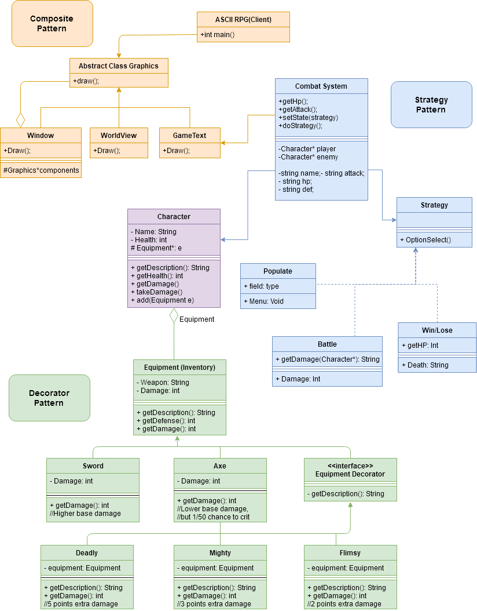

# CS 100 Programming Project

# Member information
Spring 2020  
Vincent Trejo - vtrej003@ucr.edu
Ricardo Lira - rlira004@ucr.edu
Nish Patel - npate145@ucr.edu

# Title of the project
## CS100 RPG Game "ASCII Quest"

# What application do we plan to work on? 
"ASCII Quest" is a text-based role playing game. Inspired by old-school classic role playing games, "ASCII Quest" is comprised of of multiple rpg elements; turn base combat system, character customization, "weapons" and "spells".

# Why is it important and interesting?
Important?
  It is important because people need something to do in their downtime to destress and do something fun for a while. It is especially    essential during this times to be able to do something that does not require going outside. That is why this project is so important.

Interesting?
  It's a video game! Video games, behind the scenes, require a lot of technical know-how to produce. There is also a lot of diversity in the classes and systems in place that often interact with each other.
  From a non-technical outlook, it is interesting because it is a very creative side of computer science.

# What language/tools/technology do we plan to use?
  We plan on using C++ and the terminal. 

# What will be the input/output of our project?
  The input will be a series of button presses for navigation, such as "WASD" or the Up/Down/Left/Right arrow keys. Alternatively, in combat the user will be given a text based menu indicating what options they have to utilitize as well as information about the target they are fighting. Similar buttons will be used to navigate the menu, but this will also include the "enter" key to confirm commands and "backspace" to go back.

  Output will be a GUI showing where the character is on the map. In combat, the output will be monster stats as well as character stats. There will also be text streams indicating what actions are taking place and their effects.

## Class diagram of the project

## Description of the class diagram 

**Composite Pattern (GUI)**
**Abstract Graphics**: This class is the base class for all of the graphical components of ASCII RPG.. Three subclasses inherit from the graphics class; Window class, Worldview,GameText. Each class has its own implementation of Draw().
**Window** class is the composition object of the graphics hierarchy. The window is composed of a world view object and a gametext object. This class will periodically call the Draw function to update the displays.
**WorldView** class inherits from the Graphics class and is a concrete object of the composite pattern. World views purpose is to display the world of ASCII RPG along with the characters that inhabit it. The world view class is called to draw the scene by the composite(Window) class.
**GameText** class inherits from the Graphics class and is a concrete object of the composite pattern. The GameText displays information from interactions with the environment and/or combat system. The GameText class is called to draw the scene by the composite(window) class.

**Strategy (Combat)**:
When Combat begins, the Combat System class gets the Player data (attack, hp, def) and uses these variables to create a combat encounter. It uses the Strategy Pattern since Combat utilizes different options.
    First, it uses the **Populate** class to construct a battle **Menu**(); that gives the player options to take.
    When an attack is selected, **Battle** commences and it calls the appropriate damage factors and calculates **Damage**(); for both the Player Character and the Enemy Creature and deducts it from their hp pool.
    The **Win/Lose** condition is triggered when one of the combating entities reaches 0 hp, to symbolize death/fainting. Depending on who was slain, **Death**(); would then either return “Monster Slain” or “Game Over.”
    
**Character**:
    This class is used for the internal properties of both the user and enemy characters in-game. Every character has basic qualities such as a name, health and equipment; the name is a string, the health is an integer and equipment is instantiated as equipment objects from the class explained below. For internal use between other classes of this project, accessor and mutator functions have been made for the member variables. Additionally, each character can receive damage that deducts from their health during battle. The characters (mainly the user) can also receive new equipment during their journey.

**Decorator (Equipment)**:
    Each character (player and enemies) has equipment. This includes a weapon with an optional title that increases damage. The user can use either a **Sword** or an **Axe**, and each has different properties in combat. There are additional titles that can influence the power of the weapon, namely **Flimsy**, **Mighty**, and **Deadly**.
    In terms of the general structure of the decorator design pattern, each class serves to easily add functionality (titles) to the equipment objects (weapons). 
    The component is **Equipment**. This class is a base for the other subcategories of equipment. It has member variables Weapon (string) and Damage (int), as well as public functions getDescription (returns a description of the equipment as a string), getDefense (returns an integer value of the defense stat based on equipped items), and getDamage (returns an integer value of the attack power stat). 
    The concrete components are **Sword** and **Axe**. These classes are each defined with different damage integer values -  swords do higher base damage and axes do lower base damage but have a 1/10 chance to land a critical hit (edited from UML to a more reasonable rate). Each class has a getDamage function (returns an integer value of the damage output based on the member variable).
    The abstract decorator is **Equipment Decorator**. 
    The concrete decorators are **Flimsy**, **Mighty**, and **Deadly**. Each of these adds extra damage to the weapon as indicated: flimsy (+2), mighty (+3), and deadly (+5).
